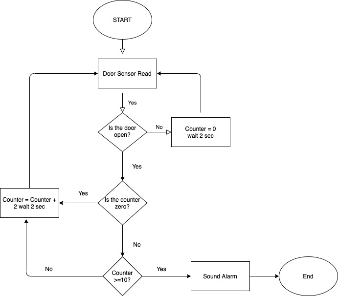
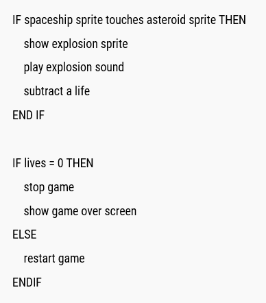

## Flow Chart VS PseudoCode
우리는 코드를 짜기 전에, 생각을 해 전체적 흐름이나 기능들을 정해놓고 시작해야 한다. 이를 위해 사람들이 사용하는 방식이 **Flow chart**와 **PseudoCode**이다.

|Flow Chart |PseudoCode |
|:---:|:---:|
| | |

여기서 확인할 수 있듯이 **Flow Chart**는 간단한 도형들을 사용해 시각적으로 프로그램의 전체적 흐름을 나타내는 것이고, **PseudoCode**는 사람이 알아볼 수 있게만, 대략적인 과정을 중간언어 쯤으로 나타내어 놓는 것이다. ~~솔직히 Python은 너무 직관적이라 PseudoCode로 써도 아무 문제가 없다.~~